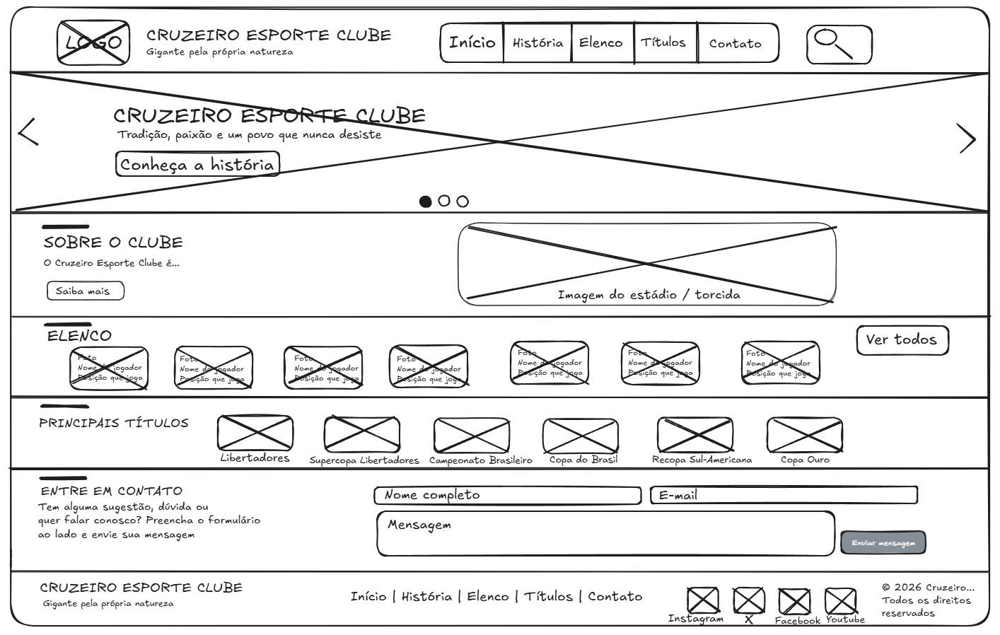
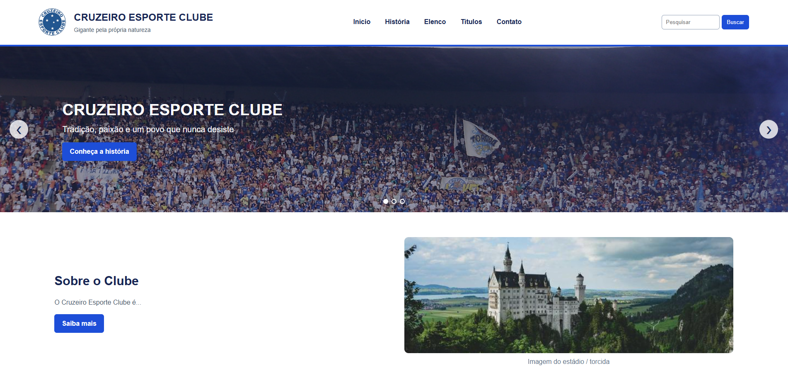
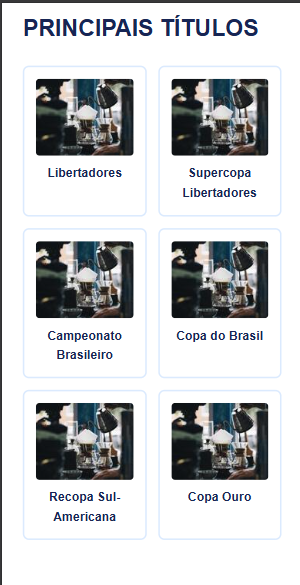
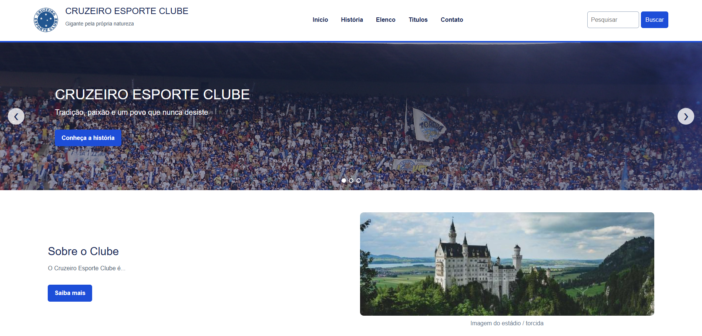
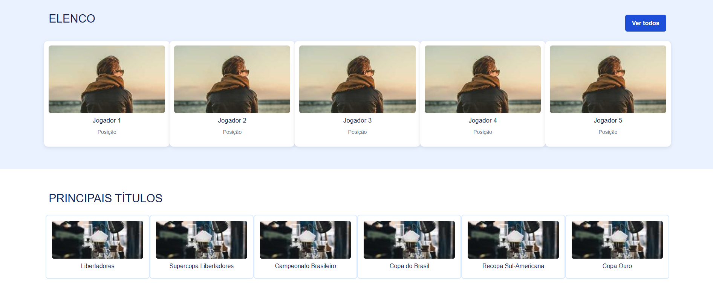
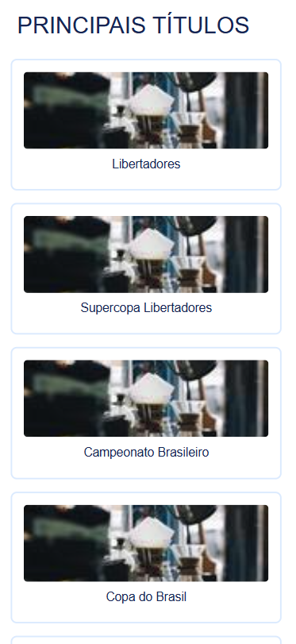

## Nome
César Monção

## Matrícula
933330

## Proposta de projeto escolhida
Proposta 3 - Organizações e Equipes

## Breve descrição sobre o projeto
Esse projeto apresenta uma página sobre o Cruzeiro Esporte Clube, montada para apresentar informações sobre o time, sua história, elenco, principais títulos e contato

## Imagem do esboço (Wireframe) criado para o projeto

## Print da home-page criada para o projeto - Desktop

## Print da home-page criada para o projeto - Mobile

## Print da home-page com Bootstrap - Desktop

## Print da home-page com Bootstrap - Mobile

